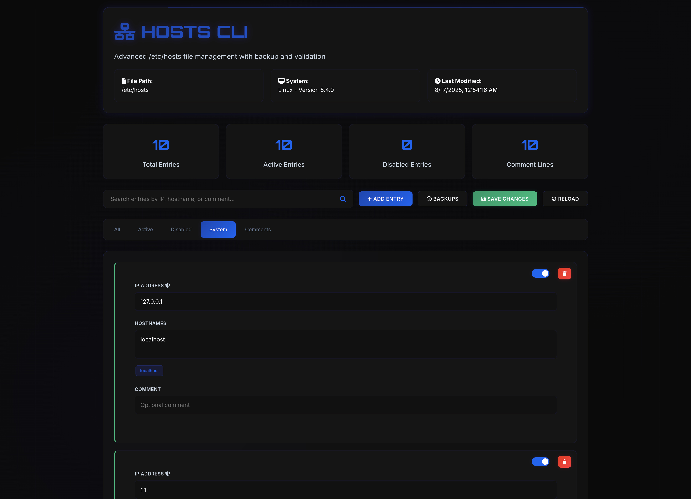

# hosts
A modern CLI tool to manage your `/etc/hosts` file with ease. It provides a web UI and CLI for managing hosts, with features like backup, validation, and Caddyfile generation.

For detailed documentation, please see the [docs.md](docs.md) file.


## Features

- **Web UI:** A user-friendly web interface for managing hosts.
- **CLI:** A powerful command-line interface for all operations.
- **Backup and Restore:** Create backups of your hosts file and restore them when needed.
- **Validation:** Validate your hosts file for correct syntax.
- **Caddyfile Generation:** Automatically generate a Caddyfile for your local domains.
- **Search and Filtering:** Easily search and filter your hosts.

## Installation

1.  **Download the latest release** from the [releases page](https://github.com/your-username/hosts/releases).
2.  **Place the executable in a directory in your PATH.**

Alternatively, you can build from source:

1.  **Clone the repository:**
    ```shell
    git clone https://github.com/your-username/hosts.git
    cd hosts
    ```

2.  **Build the binary:**
    ```shell
    go build -o hosts
    ```

## Usage

### Web UI

Start the web UI by running the `hosts` command without any flags.

```shell
./hosts
```

The web UI will be available at `http://localhost:3000`.

*Note: You may need to run the application with `sudo` to save changes to the hosts file.*

### Command-Line Interface (CLI)

The CLI provides a comprehensive set of commands for managing your hosts file.

**Add a host:**

```shell
./hosts add example.local
```

**Remove a host:**

```shell
./hosts remove example.local
```

**List all hosts:**

```shell
./hosts list
```

For more commands and options, see the [documentation](docs.md).

## License

This project is licensed under the MIT License. See the [LICENSE](LICENSE) file for details.
